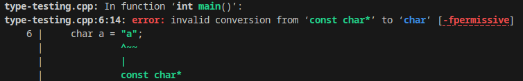

# Inserire valori di tipo differente da quello dichiarato in una variabile

o array, o matrice.

Sono tre le cose che potrebbero succede:

## 1. Errore in fase di compilazione ':)

Il compilatore individua un tentativo di inserire un valore di tipo incompatibile all'interno di una variabile, e blocca la compilazione.

Avviene ad esempio quando usi i "" e non '' per inserire in variabili di tipo char (a me succede spesso...).
"" serve per dichiarare stringhe, '' per caratteri.

```cpp
int main() {
    char a = "a"; // è illegale. const char* -> char
    char b = 'b'; // è legale.   char -> char
}
```



Questo ci ferma dallo scrivere codice poco sicuro.

## 2. Conversione implicita sicura :)

Avviene nei casi in cui il tipo che si sta cercando di inserire, è compatibile con quello inteso.

```cpp
char → short → int → float → double     (tipo)
 1       2      4      4       8        (dimensione in byte)      
```

Questo è voluto.

## 3 Conversioni implicita non sicura ://

Queste conversioni dovrebbero essere da evitare, in quanto non particolarmente sicure.

```cpp
double → float → int → short → char
```

- **double → float**: perdi precisione
- **float → int**: troncamento parte decimale con rischio di overflow se troppo grande.
- **int → short → char**: troncamento dei bit più significativi e alto rischio di overflow.

Questo può portare a comportamenti anomali da parte del nostro programma. 

## 4. Comportamento imprevedibile :(

Quando l'errore non può essere individuato in fase di compilazione (ad esempio tramite l'assegnazione usando `cin>>` a tempo di esecuzione), può avvenire a comportamento imprevedibile. Il valore potrebbe ad esempio non essere mai assegnato, come quando si usa il `cin>>` su una variabile numerica.

```cpp
#include <iostream>

using namespace std;

int main() {
    int a;
    cin>>a;
    cout<<a<<endl;
    a = getchar();
    cout<<a<<endl;
}
```
Quando utilizzi `cin>>` per assegnare una variabile di tipo int, il programma si aspetta di ricevere in input esclusivamente caratteri di tipo numerico [0-9]. L'assegnazione viene bloccata e va avanti. Usando `getchar()` viene preso un carattere dall'input. Questo può essere inserito in un intero.

```sh
./type-testing 
a
0
97
```

Otteniamo quindi questo risultato. Con `cin>>` si andrà avanti senza aver assegnato il valore, con `getchar()` no.  